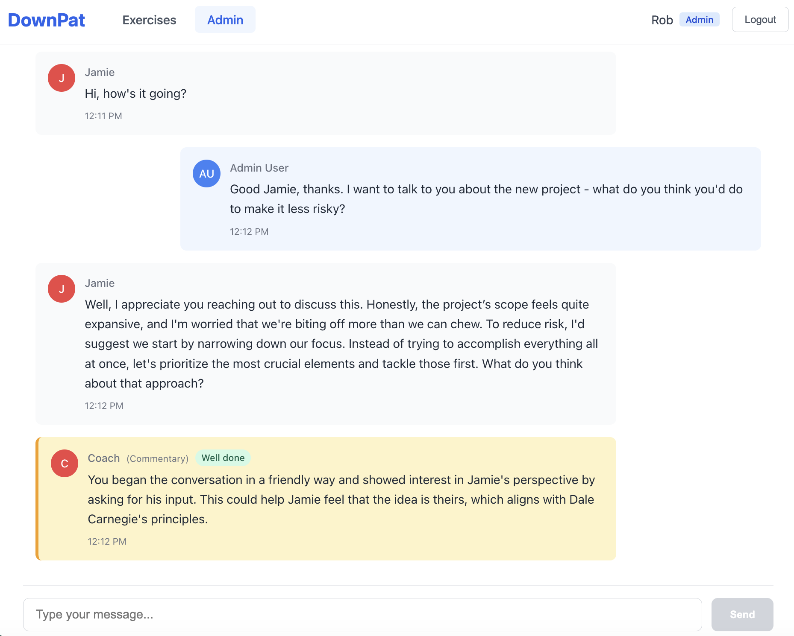
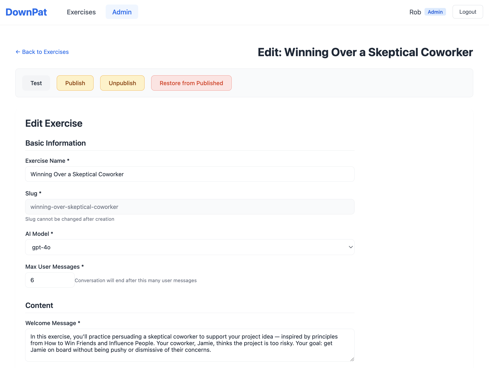

# DownPat

Open source conversational AI training platform for building immersive learning experiences.

## Overview

DownPat provides a complete toolkit for building AI-powered training applications where users practice conversations with AI coaches. It supports multiple message types (conversation, commentary, summaries), real-time updates via Socket.io, and comprehensive admin tools.

  
  

## Quickstart Demo

The fastest way to see DownPat in action is to run the example app.

### Prerequisites

- Node.js 18+
- At least one AI provider API key (OpenAI, Anthropic, or Google Gemini). OpenAI key required for moderation.

### Steps

```bash
# Clone the repo
git clone https://github.com/robhunter/oss-DownPat.git
cd oss-DownPat

# Install dependencies
npm install

# Copy the example environment file and add your API key(s)
cp .env.example .env
# Edit .env — at minimum, set one AI provider key (e.g. OPENAI_API_KEY)

# Build all packages
npm run build

# Start the dev server and client
npm run dev
```

Open http://localhost:5173 in your browser. The example app uses in-memory storage and mock authentication, so no Firebase setup is needed to try it out.

- **Login as Admin** to create and manage exercises
- **Login as User** to practice conversations

## Installation

To integrate DownPat into your own application:

```bash
# Server
npm install @downpat/express @downpat/firebase-storage

# Client
npm install @downpat/react
```

All other packages (`@downpat/core`, `@downpat/ai-adapters`, `@downpat/ui-components`, `@downpat/admin-ui`, `@downpat/api-client`) are included as transitive dependencies.

## Firebase

By default, DownPat uses Firebase Firestore for storage of exercises, conversations, and user state. Our rationale is that it's easier for you to set up a dedicated datastore for DownPat rather than try to integrate our data model into your existing database, and it's easier for us to maintain a single storage adapter. The happy path is for you to set up your own Firebase project and provide credentials, though you're welcome to replace the storage adapter to use whatever datastore you'd like.

### Firebase Setup

1. **Create a Firebase project** at https://console.firebase.google.com
2. **Create a Firestore database** in your project (start in production mode)
3. **Generate a service account key**: Project Settings → Service Accounts → Generate New Private Key
4. **Save the JSON file** to your project (e.g. `./service-account.json`) and add it to `.gitignore`
5. **Set environment variables** in your `.env`:

```bash
FIREBASE_PROJECT_ID=your-project-id

# Option 1: Path to service account JSON (local development)
GOOGLE_APPLICATION_CREDENTIALS=./service-account.json

# Option 2: Base64-encoded service account (Docker/CI)
# FIREBASE_SERVICE_ACCOUNT_BASE64=$(cat service-account.json | base64)
```

Then in your server code:

```typescript
import { createFirebaseStorage } from '@downpat/firebase-storage';

const { exerciseStorage, conversationStorage, userStateStorage } = createFirebaseStorage();
```

`createFirebaseStorage()` reads credentials from environment variables automatically. In test environments (`NODE_ENV=test`), it falls back to in-memory storage so your tests don't need Firebase access.

## Authentication

DownPat assumes that you already have some kind of user authentication set up, and that you want to control which users have access to your exercises. You'll need to implement two methods — `validateToken` and `getDemoUser` — by providing an object that satisfies the `ServerAuthProvider` interface:

```typescript
import type { ServerAuthProvider, User } from '@downpat/core';

const myAuthProvider: ServerAuthProvider = {
  // Validate a Bearer token from the request and return user info.
  // Throw an error if the token is invalid.
  async validateToken(token: string): Promise<User> {
    const session = await yourSessionStore.verify(token);
    return {
      userId: session.userId,
      displayName: session.name,
      isAdmin: session.role === 'admin',
      isSubscriber: session.hasSubscription,
    };
  },

  // Return a fallback user for unauthenticated/demo access.
  getDemoUser(): User {
    return {
      userId: 'demo',
      displayName: 'Guest',
      isAdmin: false,
      isSubscriber: false,
    };
  },
};
```

Pass your auth provider when creating the server:

```typescript
const { httpServer } = await createDownpatServer({
  app,
  basePath: '/api/downpat',
  serverAuth: myAuthProvider,
  // ...other options
});
```

For development and testing, `@downpat/express` exports a `createMockAuthProvider()` that accepts hardcoded tokens (`demo-token` and `admin-token`).

## Server Setup

```typescript
import express from 'express';
import { createDownpatServer, createMockAuthProvider } from '@downpat/express';
import { createFirebaseStorage } from '@downpat/firebase-storage';
import { createAdapterRegistryFromEnv } from '@downpat/ai-adapters';

const app = express();
app.use(express.json());

// Create storage
const { exerciseStorage, conversationStorage, userStateStorage } = createFirebaseStorage();

// Create AI adapter registry (auto-detects API keys from environment)
const aiAdapters = await createAdapterRegistryFromEnv();

// Initialize DownPat with all dependencies
const { httpServer } = await createDownpatServer({
  app,
  basePath: '/api/downpat',
  serverAuth: createMockAuthProvider(), // Replace with real auth in production
  exerciseStorage,
  conversationStorage,
  userStateStorage,
  aiAdapters,
});

httpServer.listen(3001);
```

## Client Setup

```tsx
import { BrowserRouter, Routes, Route } from 'react-router-dom';
import { DownpatRoutes } from '@downpat/react';
import '@downpat/ui-components/styles';
import '@downpat/admin-ui/styles';

function App() {
  return (
    <BrowserRouter>
      <Routes>
        {/* Your app routes */}
        <Route path="/" element={<Home />} />

        {/* DownPat routes */}
        <Route
          path="/downpat/*"
          element={
            <DownpatRoutes
              authWrapper={YourProtectedRoute}
              adminAuthWrapper={YourAdminRoute}
              basePath="/downpat"
              getAuthToken={async () => localStorage.getItem('token')}
            />
          }
        />
      </Routes>
    </BrowserRouter>
  );
}
```

## AI Integration

```typescript
import { createAdapterRegistry } from '@downpat/ai-adapters';

const registry = await createAdapterRegistry({
  openai: { apiKey: process.env.OPENAI_API_KEY },
  anthropic: { apiKey: process.env.ANTHROPIC_API_KEY },
  gemini: { apiKey: process.env.GEMINI_API_KEY },
});

// Use any configured provider
const adapter = registry.getAdapterForModel('gpt-4');
const result = await adapter.complete({
  model: 'gpt-4',
  messages: [{ role: 'user', content: 'Hello!' }],
  onChunk: (chunk) => console.log(chunk), // Streaming
});
```

## Core Concepts

### Message Types

- **USER** - User messages
- **CONVERSATION** - AI responses visible to the user
- **COMMENTARY** - Coach feedback (can be hidden/shown)
- **SUMMARY** - Conversation summaries
- **SIMPLE** - Simple coach messages (Talk to Coach feature)
- **MODERATION** - Content moderation results
- **STARTER** - Conversation starters
- **CONTEXT** - Contextual information

### Exercises

Exercises define training scenarios with guidelines, welcome messages, conversation starters, and AI tasks.

### Draft/Published Workflow

Exercises support a draft/published workflow - changes are saved to drafts, then published to make live.

## Development

### Setup

```bash
git clone https://github.com/robhunter/oss-DownPat.git
cd oss-DownPat
npm install
npm run build
npm test
```

## Environment Variables

- `OPENAI_API_KEY` - OpenAI API key for GPT models and moderation
- `ANTHROPIC_API_KEY` - Anthropic API key for Claude models
- `GEMINI_API_KEY` - Google API key for Gemini models

## Packages

| Package | Description |
|---------|-------------|
| `@downpat/express` | Express router, Socket.io, and AI adapters (server) |
| `@downpat/react` | React components, hooks, and routing (client) |
| `@downpat/firebase-storage` | Firebase Firestore storage implementation |
| `@downpat/core` | Core types and interfaces (included automatically) |
| `@downpat/ai-adapters` | OpenAI, Anthropic, and Gemini adapters (included in express) |
| `@downpat/ui-components` | React UI components (included in react) |
| `@downpat/admin-ui` | Admin interface components (included in react) |
| `@downpat/api-client` | API client for server communication (included in react) |

## Project Structure

```
packages/
├── core/              # Types, interfaces, controllers
├── firebase-storage/  # Firestore storage implementation
├── express/           # Express router & Socket.io
├── ui-components/     # React components & theme generator
├── admin-ui/          # Admin components
└── ai-adapters/       # AI provider adapters

example-app/
├── server/            # Express API server
└── client/            # React + Vite client
```

## Verification

See [VERIFICATION.md](VERIFICATION.md) for testing and browser verification instructions.

## License

MIT
